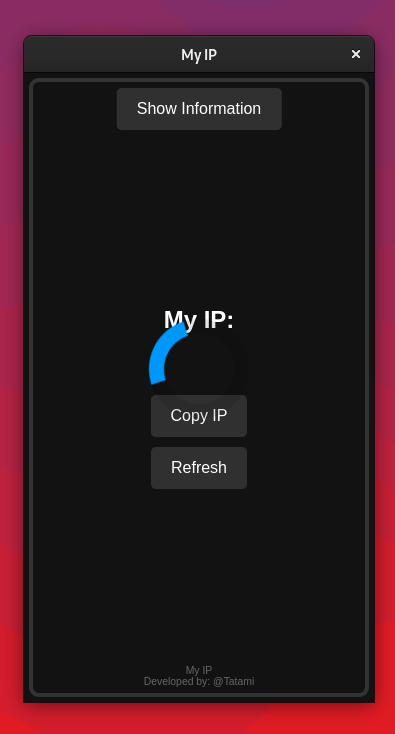
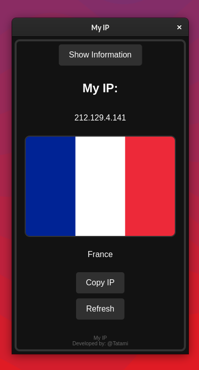
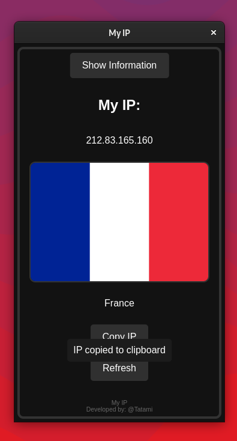

# My-IP-LINUX

# Description

  

  <h1>My IP</h1>

"My IP" is a lightweight Linux program designed to quickly display your current IP address and its associated country flag. It is ideal for users who want real-time information about their internet connection, whether they are using wired connections, Wi-Fi, VPNs, or proxies.
## Screenshots

  
  
  

## Features

- Displays your current public IP address
- Shows the country and flag associated with your IP address
- Provides a "Refresh" button to fetch the latest IP information instantly
- Optimized UI for fast loading and minimal system resource usage
- Copy your IP address to the clipboard with a simple click
- Designed with a simple and user-friendly interface for all users

